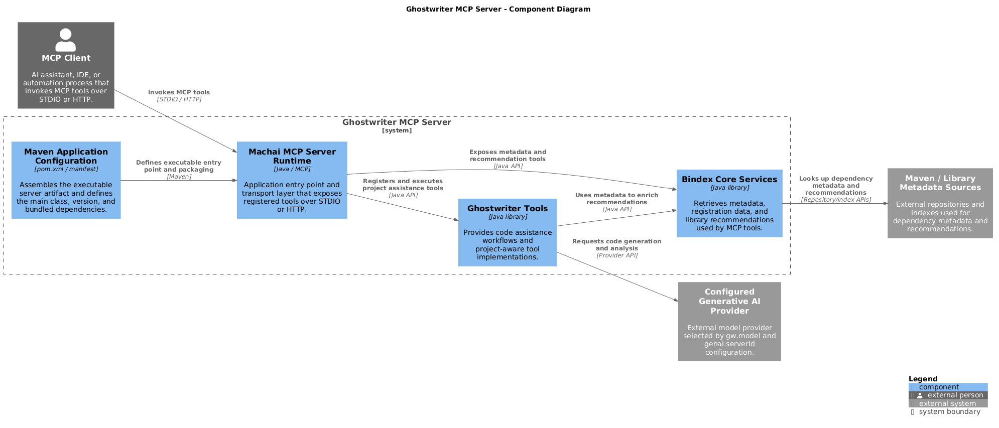

<!-- @guidance:
Generate or update the content as follows.  
**Important:** If any section or content already exists, update it with the latest and most accurate information instead of duplicating or skipping it.
# Page Structure: 
1. Header
   - Project Title: need to use from pom.xml  
   - [](https://sourceforge.net/projects/machanism/files/machai/gw-mcp-server/releases/)
   - [](https://m8ven.ai/mcp/machanism-org/gw-mcp-server) 
   - Bindex Badge [](https://raw.githubusercontent.com/machanism-org/[artifactId]/refs/heads/main/bindex.json)
2. Overview
   - Review the relatad web page: `https://machai.machanism.org/ghostwriter/functional-tools.html` (selector: #bodyColumn).
   - Review the relatad web page: `https://machai.machanism.org/bindex-core/functional-tools.html` (selector: #bodyColumn).
   - Review the relatad web page: `https://machai.machanism.org/mcp-server-maven-plugin/index.html` (selector: #bodyColumn).
   - Full description of purpose and benefits.
   - Use: src/site/resources/images/c4-diagram.png
4. Supported Functional Tools.   
5. Download Page
   - url: `https://sourceforge.net/projects/machanism/files/machai/gw-mcp-server/releases/`.
6. Usage
   - Jar file can be used as a STDIO or HTTP MCP server, `how to use` information: `https://machai.machanism.org/machai-mcp-server/index.html#CLI`. 
7. Key Features
   - Bulleted list highlighting the primary capabilities of the project.
8. Getting Started
   - Prerequisites: List of required software and services.
   - Basic Usage: Example command to run the plugin.
   - Typical Workflow: Step-by-step outline of how to use the project artifacts.
9. Resources
   - List of relevant links (platform, GitHub, Maven).
-->

# Ghostwriter MCP Server

This project is published as `org.machanism.machai:gw-mcp-server` and requires Java 17 or newer.

[](https://sourceforge.net/projects/machanism/files/machai/gw-mcp-server/releases/) [](https://m8ven.ai/mcp/machanism-org/gw-mcp-server) [](https://raw.githubusercontent.com/machanism-org/gw-mcp-server/refs/heads/main/bindex.json)

## Overview

Ghostwriter MCP Server packages Machai Ghostwriter automation tools and Bindex Core catalog tools into a runnable Model Context Protocol (MCP) server. It uses the Machai MCP Server runtime to expose project-aware capabilities over STDIO for local desktop integrations or over HTTP for remote and tool-driven automation.

Ghostwriter contributes workflow automation, file and command operations, project context sharing, guidance-tag processing, web access, and reusable Act execution. Bindex Core adds metadata discovery, descriptor retrieval and registration, schema access, and library recommendations based on project needs. Together, these capabilities let MCP-compatible clients inspect and update projects, run guided workflows, discover useful dependencies, and publish or consume Bindex metadata through a standard MCP interface.

The server is useful for AI-assisted development environments, repeatable project automation, documentation generation, dependency discovery, and build or IDE integrations that need a single gateway for Machai functional tools. The related MCP Server Maven Plugin can also start an HTTP MCP server from Maven builds, while this project provides a standalone packaged server jar.



## Supported Functional Tools

The server distribution includes the functional tools supplied by Ghostwriter and Bindex Core. Download the standalone Bindex Core jar here:

[](https://sourceforge.net/projects/machanism/files/machai/bindex/bindex.jar/download)

Add `bindex.jar` to the classpath to use these Bindex-related functional tools with the [Machai MCP Server](https://machai.machanism.org/mcp-machai-server/index.html). It can also be included alongside this server when Bindex tools are needed independently.

### Ghostwriter tools

- **Act tools:** inspect, run, and retrieve reusable named workflows with `get-act-details`, `perform-act`, and `get-act-result`.
- **Act episode control tools:** navigate or repeat ActProcessor episodes with `move-to-episode` and `repeate-episode`.
- **Command tools:** run approved project commands and inspect captured logs with `run-sys-command`, `get-log-chunk`, and `get-log-matches`.
- **Execution control tools:** intentionally terminate processing or end an interactive task with `terminate-execution` and `end-task`.
- **File tools:** inspect a directory with `list-files-in-directory`; recursively inventory files with `get-recursive-file-list`; inspect directory contents with `get-recursive-folder-list`; read or replace text with `read-file` and `write-file`; and make focused edits with `apply-patch-to-file`. The directory-listing tool accepts an optional `path` and defaults to `.`.
- **Guidance tools:** identify files containing guidance tags with `get-files-with-guidance-tags`, process them with `process-files-with-guidance-tag`, and retrieve asynchronous processing reports with `get-process-guidance-tag-files-result`. These tools are supported for ActProcessor workflows.
- **Project context tools:** store and retrieve shared project state with `put-project-context-variable` and `get-project-context-variables`, or accumulate and consume values with `push-project-context-variable` and `pop-project-context-variable`.
- **Web tools:** retrieve an HTTP(S) page or project-scoped file with `get-web-content`, including optional plain-text conversion or CSS selection, and make configurable REST requests with `call-rest-api`. Both support headers, character sets, timeouts, and URL user-info Basic authentication.

### Bindex Core tools and resources

- **`get-bindex`:** retrieve a Bindex descriptor from a registered identifier, HTTP(S) URL, or `file://` path, optionally selecting fields with a GraphQL-style query.
- **`pick-libraries`:** recommend libraries from a natural-language description of project needs using semantic relevance criteria.
- **`register-bindex`:** register a Bindex descriptor read from a project file or HTTP(S) URL.
- **`register-bindex-json`:** register a Bindex descriptor supplied directly as JSON.
- **`getBindexSchema` resource:** expose the Bindex v2 JSON Schema for validation.
- **`generate-bindex` prompt:** provide the prompt template used to generate Bindex descriptor files.

### MCP Server Maven Plugin tool

- **`stop-mcp-server`:** request an orderly shutdown of a running Machai MCP Server. It accepts an optional integer `exit-code` (default `0`), acknowledges the request immediately, and performs the shutdown in the background.

The [MCP Server Maven Plugin](https://machai.machanism.org/mcp-server-maven-plugin/index.html) provides the `stateless` and `streamable` aggregator goals. Both goals configure and start an HTTP MCP server using the Maven project's metadata, base directory, port, configuration file, and registered tools.

## Download Page

Download release artifacts from SourceForge:

- [Ghostwriter MCP Server releases](https://sourceforge.net/projects/machanism/files/machai/gw-mcp-server/releases/)

## Usage

The packaged jar can be used as either a STDIO MCP server or an HTTP MCP server. The main class is `org.machanism.machai.mcp.server.McpServer`.

Run in STDIO mode (the default when `--port` is omitted):

```bash
java -jar gw-mcp-server-1.4.2-SNAPSHOT.jar
```

Run in HTTP stateless mode on port `45000`:

```bash
java -jar gw-mcp-server-1.4.2-SNAPSHOT.jar --port 45000
```

Run in HTTP streamable-session mode with a project directory and configuration file:

```bash
java -jar gw-mcp-server-1.4.2-SNAPSHOT.jar \
  --projectDir /path/to/project \
  --config /path/to/mcp.properties \
  --name gw-mcp-server \
  --version 1.4.2-SNAPSHOT \
  --port 45000 \
  --session
```

The same HTTP transports can be started from a Maven build with the MCP Server Maven Plugin. Use `stateless` for stateless HTTP:

```bash
mvn org.machanism.machai:mcp-server-maven-plugin:1.4.2-SNAPSHOT:stateless \
  -Dmcp.port=45000 \
  -Dmcp.config=/path/to/mcp.properties
```

Use `streamable` when the client requires streamable HTTP sessions:

```bash
mvn org.machanism.machai:mcp-server-maven-plugin:1.4.2-SNAPSHOT:streamable \
  -Dmcp.port=45000 \
  -Dmcp.config=/path/to/mcp.properties
```

Common CLI options include `--projectDir`, `--config`, `--name`, `--version`, `--port`, and `--session`. If `--port` is omitted, the server starts in STDIO mode. If `--port` is supplied, the server starts over HTTP; `--session` switches HTTP transport from stateless to streamable mode.

See the [Machai MCP Server CLI documentation](https://machai.machanism.org/machai-mcp-server/index.html#CLI) for the complete option reference and client configuration examples.

## Key Features

- Provides a standalone MCP server for Ghostwriter and Bindex Core functional tools.
- Supports both STDIO and HTTP transports from the same runnable jar.
- Exposes stateless HTTP and streamable HTTP session modes.
- Enables project-aware file, command, guidance, context, web, and workflow automation.
- Supports Bindex metadata retrieval, registration, validation resources, and library recommendations.
- Supports Maven-driven stateless and streamable HTTP server startup through the MCP Server Maven Plugin.
- Uses Java 17 and Maven packaging; the optional `pack` profile assembles dependencies into a runnable release artifact.
- Allows MCP clients to configure server metadata, project directory, port, and runtime configuration at launch.
- Keeps functional tools decoupled from the MCP transport while publishing them through a standard MCP-compatible interface.

## Getting Started

### Prerequisites

- Java 17 or newer.
- Maven, if building the project from source.
- An MCP-compatible client such as Claude Desktop, MCP Inspector, CodeMie Code, or another STDIO/HTTP MCP client.
- Required environment variables, credentials, model names, and service configuration for the selected Ghostwriter, Bindex, and AI-provider tools.
- Network access and an available TCP port when running in HTTP mode.
- A readable MCP properties file when custom runtime configuration is needed.

### Basic Usage

Run the MCP Server Maven Plugin to start a stateless HTTP server for the current Maven project:

```bash
mvn org.machanism.machai:mcp-server-maven-plugin:1.4.2-SNAPSHOT:stateless \
  -Dmcp.port=45000 \
  -Dmcp.config=/path/to/mcp.properties
```

Build the project:

```bash
mvn clean package
```

Create the assembled release artifact during install by enabling the `pack` profile:

```bash
mvn -Ppack clean install
```

Start the server after downloading the release jar or running `mvn -Ppack clean install` (the assembly is written to the release directory configured by `MACHANISM_PACK_DIR`):

```bash
java -jar gw-mcp-server-1.4.2-SNAPSHOT.jar --port 45000 --projectDir /path/to/project
```

### Typical Workflow

1. Download a release jar or build the project with Maven.
2. Prepare any required MCP configuration, model settings, credentials, and Bindex registration credentials.
3. Choose STDIO for local desktop integrations or HTTP for remote/client-server access.
4. Start the jar, optionally supplying `--projectDir`, `--config`, `--name`, `--version`, `--port`, and `--session`.
5. Connect an MCP client to the STDIO process or to the HTTP endpoint, such as `http://localhost:45000/mcp`.
6. Verify that Ghostwriter and Bindex tools are visible in the client.
7. Invoke tools to process project files, run guided workflows, retrieve or register Bindex metadata, and discover recommended libraries.
8. Monitor logs and adjust runtime configuration when troubleshooting tool registration, credentials, or transport behavior.

## Resources

- [Machai platform](https://machai.machanism.org/)
- [Machai GitHub repository](https://github.com/machanism-org/machai)
- [Ghostwriter MCP Server GitHub repository](https://github.com/machanism-org/gw-mcp-server.git)
- [Ghostwriter functional tools](https://machai.machanism.org/ghostwriter/functional-tools.html)
- [Bindex Core functional tools](https://machai.machanism.org/bindex-core/functional-tools.html)
- [Machai MCP Server CLI documentation](https://machai.machanism.org/machai-mcp-server/index.html#CLI)
- [MCP Server Maven Plugin](https://machai.machanism.org/mcp-server-maven-plugin/index.html)
- [Maven Central: Ghostwriter MCP Server](https://central.sonatype.com/artifact/org.machanism.machai/gw-mcp-server)
- [Maven Central: Machai MCP Server](https://central.sonatype.com/artifact/org.machanism.machai/machai-mcp-server)
- [Ghostwriter MCP Server releases](https://sourceforge.net/projects/machanism/files/machai/gw-mcp-server/releases/)
